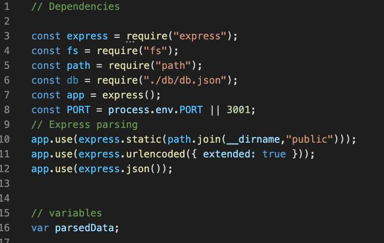
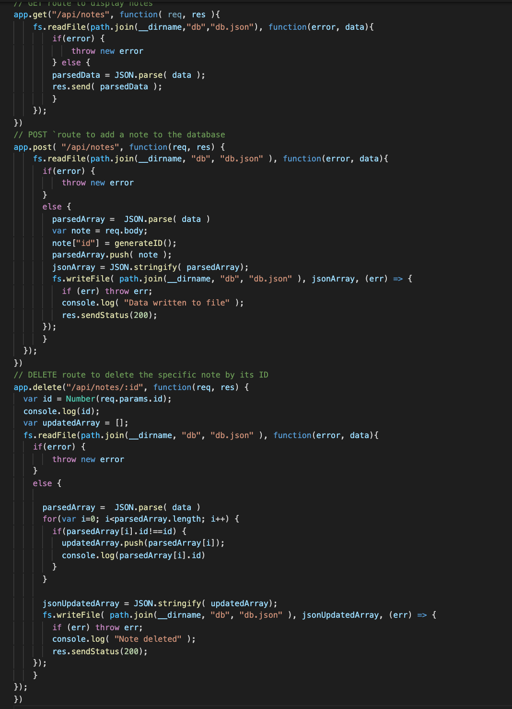
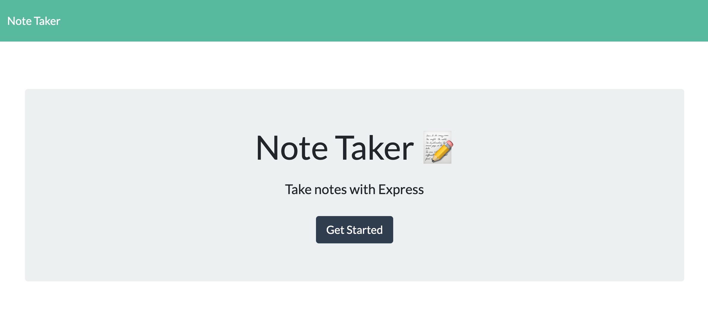
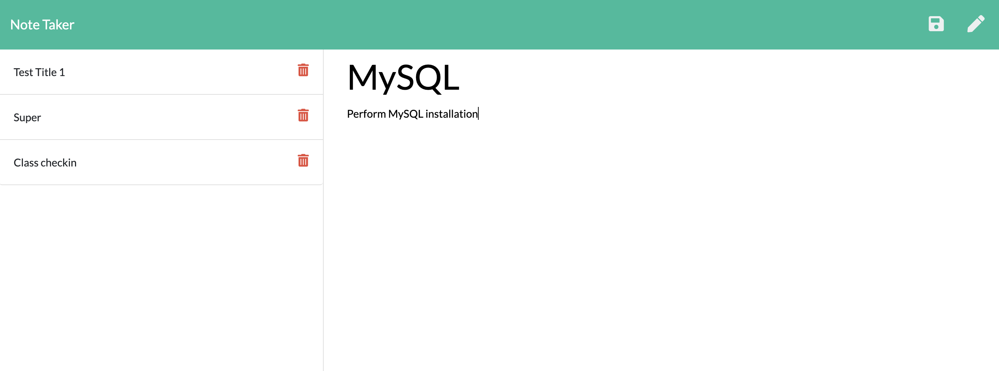
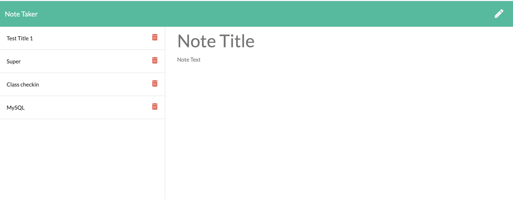
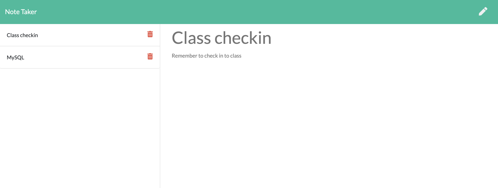

# Note Taker 

## Table of Contents
1. [ Description ](#desc)
2. [ Task ](#task)
3. [ Link to Heroku deployment ](#link)
4. [ Structure ](#structure)
5. [ Finished product ](#final)
6. [ Contact details ](#contact)

## 1. Description
This repository contains code for the application that allows user to view add, save, and delete notes that are being stored in the database.  

## 2. Task
Task is to build a test-driven application that takes in information about employees and dynamically generates an HTML webpage that displays summaries for each person.
This application is designed to allow user to write, save, and delete notes. This application uses an express backend and saves and retrieves note data from a JSON file. A db.json file on the backend is used to store and retrieve notes using the fs module.

The following routes have been created:
GET /notes - Returns the notes.html file.
GET * - Returns the index.html file
GET /api/notes - Reads the db.json file and returns all saved notes as JSON.
POST /api/notes - Receives a new note to save on the request body, add it to the db.json file, and then return the new note to the client.
DELETE /api/notes/:id - Receives a query parameter containing the id of a note to delete.

## 3. Link to Heroku deployment 
The project is deployed on Heroku and available for view using this link:
https://note-taker-heroku-kat.herokuapp.com/ 

## 4. Structure
The following routes have been created:
* GET /notes - Returns the notes.html file.
* GET * - Returns the index.html file
* GET /api/notes - Reads the db.json file and returns all saved notes as JSON.
* POST /api/notes - Receives a new note to save on the request body, add it to the db.json file, and then return the new note to the client.
* DELETE /api/notes/:id - Receives a query parameter containing the id of a note to delete.
The unique ID is being generated as a timestamp inside POST request.
The screenshot below show the imported dependencies

The screenshot below show the routes

## 5. Finished product
Here are the screenshots of the landing page:

Here is the screenshot of the page showing how the note is added

Here is the screenshot of the page showing how the added note is saved and displayed in the side bar

Here is the screenshot of the page showing how the note is deleted

## 6. Contact details
If you have any questions, contact me via email: 

